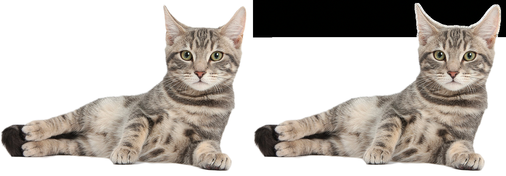

# Information-Hiding-System
The system that can keep your secret data safe using techniques of Cryptography and Steganography.

The system consists of 3 modules. These are: Crypto Module, Stego Module and User Interface module.

As will be evident from their names, the **Crypto Module**, encrypts the text document received from the user.
The user can choose the encryption algorithm. There are currently 3 algorithms available. These are AES, DES and 3DES. 
After the algorithm is selected, the user enters the password he/she wants to encrypt and the text is encrypted as 'filename_enc.txt'.

**User Interface** module is the module that communicates with the user. Operations such as selecting the text document to be encrypted, specifying the algorithm, entering its key, and selecting the cover image are done here and sent to other modules.

The **Stego module** is used to embed the encrypted text document with a '*.png' extension in a user-selected cover image.

## Installation

### Pip:

Libraries in the "requirements.txt" file must be installed to run the system.

> **$pip install -r requirements.txt**

## Usage 

After installation is completed, the system can be runned with:
> **$py "Data Hiding System.py"**

However, if it is desired to run like a file with the '*.exe' extension, the "PyInstaller" library can be downloaded and the file can be converted to an '*.exe' file.

To do this, 'PyInstaller == 4.0.dev0 + 9dd34bdfba' version can be used. The code below can be used to download it.

> **$pip install PyInstaller == 4.0.dev0 + 9dd34bdfba**

## Output

After the system embeds the encrypted text into the cover image, an image that combines the first and final version of the cover image is created. This picture can be used to understand the clarity of your data in the picture.

When we encrypt the "text_to_hide_long.txt" file with the AES algorithm and embed it in the cover image, the difference between the images is as in the example above.
